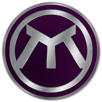

# Linda Coin
Lindacoin is a peer to peer hybrid digital currency. It creates utility products that allow Linda to be used in everyday scenarios. It also offers partnership opportunities to other cryptocurrencies to use the Lindacoin platform. As the Linda wallet technology evolves, we strive to simplify the processes of staking or masternode ownership as well as improve your overall wallet experience

## Specs
<table>
<tr><td>Coin Name</td><td>Linda Coin</td></tr>
<tr><td>Abbreviation</td><td>LINDA</td></tr>
<tr><td>Coin Type</td><td>PoS (Proof of Stake)</td></tr>
<tr><td>Max Supply</td><td>30,000,000,000</td></tr>
<tr><td>Block Time</td><td>60 Seconds</td></tr>
<tr><td>Maximum Block Size</td><td>4MB</td></tr>
<tr><td>Minimum Stake Age</td><td>24 Hours</td></tr>
<tr><td>Maximum Stake Age</td><td>30 Days</td></tr>
<tr><td>Maximum Stake Amount</td><td>100,000,000</td></tr>
<tr><td>Masternode Emissions</td><td>~60% Annually</td></tr>
<tr><td>Staking Emissions</td><td>~50% Annually</td></tr>
<tr><td>Masternode Port</td><td>33820</td></tr>
<tr><td>RPC Port</td><td>33821</td></tr>
</table>

## Masternode
Lindacoin’s use of masternodes enables Linda to have unique features that are not possible in other cryptocurrencies. Our masternodes do the brunt of the work, sorting out blocks and managing peers. The Linda community will operate these masternodes to help keep the network flowing. Our masternodes perform all of the InstantX and private transactions, and are the heart of our blockchain. A masternode is simply a Linda full node or a computer wallet that stores the complete copy of the blockchain in real time. But, the central nodes are considerably different - they perform more functionalities to give Linda special features. One example of this is Linda’s extraordinary speed and instant transactions. This makes Linda transactions suitable for everyone. Some of the unique functions that these nodes perform are: 

● Increasing the confidentiality of transactions 

● Making instant transactions 

● Participating in governance and voting 

● Activating the budget and cash system in cryptos. 

Masternodes have huge value in supporting the Linda network. They are part of what defines Lindacoin from all of the other cryptocurrencies. Making Linda more efficient, and more prepared for the future.

*A masternode requires 2 million Linda Coins.

## One Click Masternodes
Linda’s new mobile wallet and mobile app offers a turnkey solution, changing the dynamic of which masternodes are implemented to the user.  It is now easier than ever for the Linda community to get involved in operating a masternode. Currently, masternodes are extremely difficult to set up unless you’re technically experienced and leads to users potentially missing out. TurnKey options are masternodes that are already set up for the user. 

*This is for users who wish to have a more hands off approach to operating masternodes.

## Staking
Proof of Stake (PoS) is a type of consensus algorithm for public blockchains. It ensures all wallets have a consensus on all transactions. It also weighs the economic stake of each wallet, so the more LINDA a wallet has, the more it will have a say in the public blockchain. Unlike Bitcoin, where the algorithm rewards participants who solve cryptographic puzzles (Proof of Work), Linda uses the PoS system. Each wallet votes on the next block and the voting weight of each validator depends on the amount of LINDA they hold. One of the significant benefits of a PoS system is the energy efficiency. Instead of wasting huge amounts of energy to mine coins, Linda is a more eco-friendly coin, which means it is more likely to be adopted in the future. Also, a PoS algorithm reduces the chance of centralization. Other coins are likely to be centralized as all their miners are controlled by a few people, but this is not possible with Linda. Finally, a PoS algorithm increases security. Linda allows all wallets to get involved in staking. By simply holding your coins in a wallet, Linda will automatically stake your coins for you. Staking helps Linda stabilize the blockchain and will help Linda verify transactions.

## Core Team
#### Administrators

•	Jonah Glasgow - Chief Executive Officer

•	Stephen Newton - Director of Finances & Legal

•	Justin Tether - Director of Support & Solutions

•	Gaelin McBride - Director of Marketing & Merchandise

•	David Grear - Director of Community Relations & Project Development

•	Chris Wallace - Technical Writer 

•	David Gokhshtein - Advisor

#### Developers

•	Chris Bowe - Director of Web-wallet & Pool

•	Matthew Randall - Director of Development

•	David Grunge - Lead Developer 

## Social
[Website](https://www.lindacoin.com)

[Discord](https://discord.gg/SHNjQBv)

[Reddit](https://www.reddit.com/r/Lindacoin)

[Twitter](https://twitter.com/lindaproject)

[Facebook](https://www.facebook.com/lindacoincurrency)

[Telegram](https://t.me/OfficaLindaproject)

[GitHub](https://github.com/Lindacoin/Linda)

[YouTube](https://www.youtube.com/channel/UCzfjb47BI9lx7Ih-K6VY-TA)

## Handy Links
[Linda FAQ, tips, media and tutorials](https://www.lindaprojectinfo.com)

[Bootstrap your wallet](https://bit.ly/lindabootstrap)

## Realizations

### MyStakingWallet - Official Web Wallet (Staking & Masternode)
[Website](https://www.mystakingwallet.com)

[Discord](https://discord.gg/j4MebEY)

[Android App](https://play.google.com/store/apps/details?id=com.mystakingwallet.app)

[iOS App](https://itunes.apple.com/us/app/linda-my-staking-wallet/id1404883927)

### MyNodePool - Official Staking Pool
[Website](https://www.mynodepool.com)

[Discord](https://discord.gg/2sMJnjk)
